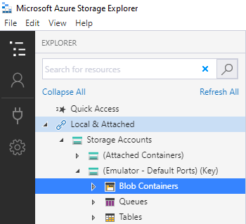
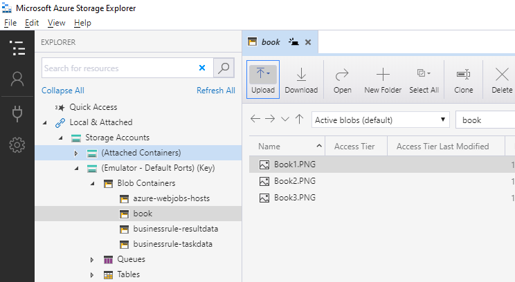
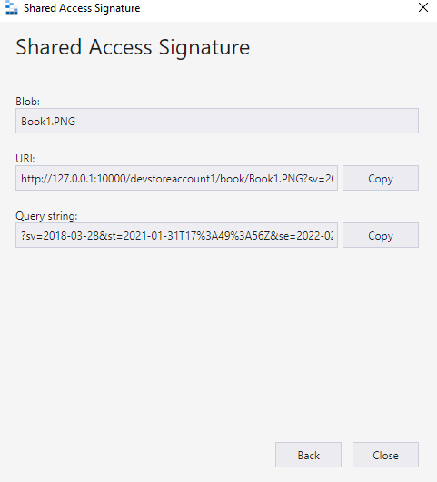
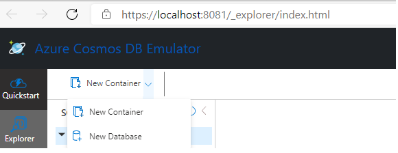
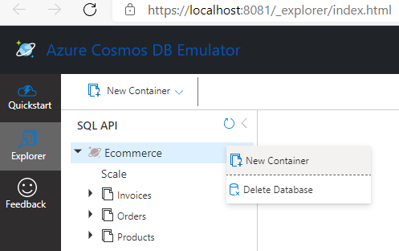
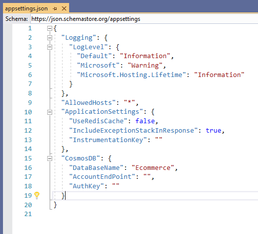
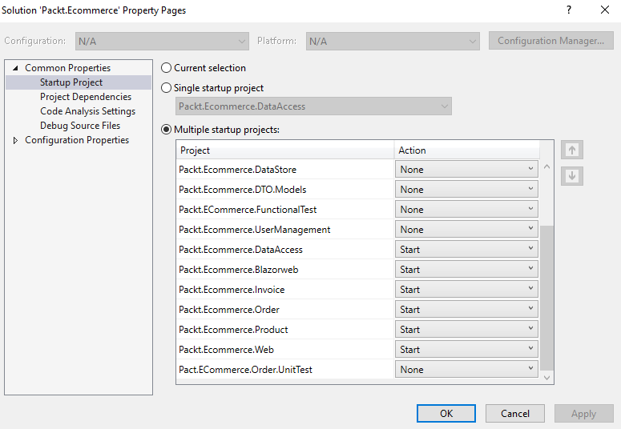

# Instructions to setup code locally

1) Install Azure Storage emulator as mentioned in https://docs.microsoft.com/en-us/azure/storage/common/storage-use-emulator
2) Install Azure Cosmos DB emulator as mentioned in https://docs.microsoft.com/en-us/azure/cosmos-db/local-emulator?tabs=cli%2Cssl-netstd21
3) Run both the emulators
4) Install Azure Storage explorer https://azure.microsoft.com/en-in/features/storage-explorer/ and connect to the local Azure Storage instance



5) Create a container **book** and upload image files that can be used as products for ecommerce application. Few sample images are available in readmeimages folder.



6) Right click on the images and click on **Get Shared Access Signature...** and generate the URL of the image. Generate the URL that can be valid for an year by increasing the time range.



7) Repeat this process for all images and Copy the URLs, these will be used to store in the Cosmos DB.
8) Navigate to the localhost URL used as data explorer of Azure Cosmos DB Emulator, and create a new database by clicking on New Container -> New Database and name it **Ecommerce**. 


- Add following 3 Containers
  - Invoices
  - Orders
  - Products
  - 


9) Navigate to the **Products** container and insert a new record using the following json schema. Ensure to update **ImageUrls** value with the URL saved in step 7

```
{
    "id": "Book.1",
    "Name": "Title1",
    "Category": "Books",
    "Price": 500,
    "Quantity": 11,
    "CreatedDate": "2020-09-16T16:57:31.1095445Z",
    "ImageUrls": [
        "Local image URL" 
    ],
    "Rating": [
        {
            "Stars": 5,
            "Percentage": 80
        }
    ],
    "Format": [
        "E Book",
        "Hard cover"
    ],
    "Authors": [
        "Author1"
    ],
    "Size": [],
    "Color": []
}
```


10) Update AccountEndPoint,AuthKey in appsettings.json of Packt.Ecommerce.DataAccess.



11) Setup startup projects as shown in the image and press F5 in Visual Studio application should be up and running (Multiple browser tabs each representing one application)




# Static Analyzers

All the projects have following static analyzers integrated with them as a Nuget package reference.

- Microsoft.CodeAnalysis.FxCopAnalyzers
- SonarAnalyzer.CSharp
- StyleCop.Analyzers

These are automatically added to any project that is part of this solution through the **Directory.Build.props** file in root of the repository.